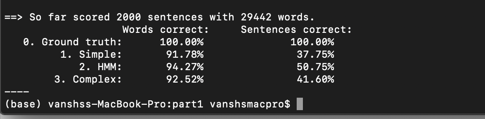
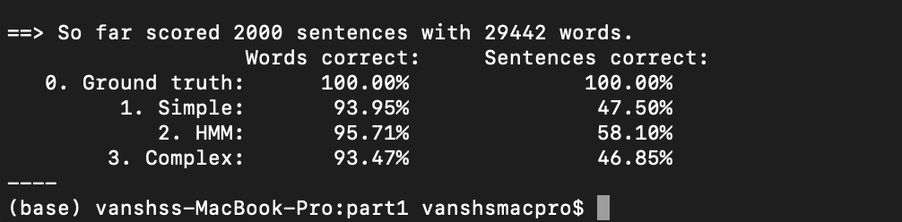

---
output:
  pdf_document: default
  html_document: default
<h2>Part 1 :</h2> 

Goal : 
Here , our goal was to predict tags for the given model : simplified bayesian network , Viterbi and mcmc(gib’s sampling ). And calculate their respective accuracy and return their log posterior probability . 

Method : 

Simplified : 
Here for the specified method we had to calculate the probability of tag|word I.e tag given word.  For that we had to calculate p(s|w) ~ p(w|s)*p(s) where p(s|w) is our posterior and and p(w|s) is likelihood and p(s) is our prior . 
To calculate p(w|s) I have made function which is emission probability and multiplied that with the corresponding prior . 

Viterbi : 
Here for Viterbi we need transition probability I.e p(s1|s2) and also emission probability. Hence emission probability can be calculated from the above described method as well and for transition probability I have created a 2D matrix that will store all the transitions from the training data given . 
Viterbi consists of two parts :  Forward algorithm to calculate all probabilities and backward algorithm which is used to trace the most probable sequence of all probabilities that are calculated . Here we also need the initial probability
I.e probability of noun occurring as the first word , probability of verb occurring as a first word and so on for all the tags . 
We will then multiply the initial probability with that of the emission probability for the first word and get 12 probabilities . For that 12 probabilities we will keep on multiplying with their respective transition and emission probability. 
After that we will find the max probability that we have got for the last word and then we will back track from there to find the most probable sequence. 

MCMC(gib’s sampler) : 
Here, For the gib’s sampler we will first initialize our sample with that of the length of the sentence. After that we will update each tag keeping the remaining tags as constant. After each iteration we will generate new sample and we will take this sample and repeat this procedure for n times till the time it converges. 

After we have a sample list of n samples we will use that sample to predict the most common tag for that particular word and return the predicted tags .

Challenges faced : 

Here there are many cases when the word present in test data is not there in the train data and so we cannot initialize zero probability or else all other probabilities after that word would become zero as the probabilities are multiplied. Hence for that we need to assign some random value to our model. This is tuning of the model which we had to do so that we get better word accuracy as well as better sentence accuracy. 
Hence we gave an initial value of 0.0000001 to all the probabilities as the probabilities that are generated won’t be affected and it won’t get zero and so the labels will be predicted right for the remaining of the words in the test sentence. 

Result :

Hence We got such accuracy where we get around 92% words correct for simplified bayesian network , 94.3 % accuracy for Viterbi I.e hmm , 92.6% correct words for gib’s sampling.
Here we got around 50.75 % correct sentences for Viterbi , 42% correct for gib’s and 38% for simplified . 
After careful observation of the data I found out that the number of words that are labelled nouns are much more and so the probability of a word that is not there in the training corpus but is there in testing data : for them the probability that it is a noun should be a bit higher than the probability that they are other tags.
For that we did some pre-processing from the data and learned from the data set that noun is one of the most recurring words. 
Hence so after that we assigned the probability of a word being noun as 0.01 and other than that we assigned 0.0000001 and got much  improved results than what we had previously obtained. 

Result :



We got the  our sentence accuracy for simplified getting increased by 10% to 47.5% and the word count accuracy gets increased by around 2 % to 94 %. 
We get our Viterbi model sentence accuracy increase by 8 % to 58.2 % and the word count accuracy gets increased by 1.5 % to around 96%.
We get our Gib’s model sentence accuracy increase by 5% to 47% and the word count accuracy gets increased by 1% to around 94%. 

Here for the gib’s sampling we are taking the initial sample to be sequence of all nouns and iterating for over 2000 iterations .

Conclusions : 

From the above results we can conclude that Viterbi is the best algorithm and if the all the tags are taken of equal value gib’s sampler is a bit better than the simplified model. 
From the above results assuming that for this dataset we are finding I have assigned higher value for noun than that of other tags. 

Question 1 :

Goal : 
Here , our goal was to predict tags for the given model : simplified bayesian network , Viterbi and mcmc(gib’s sampling ). And calculate their respective accuracy and return their log posterior probability . 

Method : 

Simplified : 
Here for the specified method we had to calculate the probability of tag|word I.e tag given word.  For that we had to calculate p(s|w) ~ p(w|s)*p(s) where p(s|w) is our posterior and and p(w|s) is likelihood and p(s) is our prior . 
To calculate p(w|s) I have made function which is emission probability and multiplied that with the corresponding prior . 

Viterbi : 
Here for Viterbi we need transition probability I.e p(s1|s2) and also emission probability. Hence emission probability can be calculated from the above described method as well and for transition probability I have created a 2D matrix that will store all the transitions from the training data given . 
Viterbi consists of two parts :  Forward algorithm to calculate all probabilities and backward algorithm which is used to trace the most probable sequence of all probabilities that are calculated . Here we also need the initial probability
I.e probability of noun occurring as the first word , probability of verb occurring as a first word and so on for all the tags . 
We will then multiply the initial probability with that of the emission probability for the first word and get 12 probabilities . For that 12 probabilities we will keep on multiplying with their respective transition and emission probability. 
After that we will find the max probability that we have got for the last word and then we will back track from there to find the most probable sequence. 

MCMC(gib’s sampler) : 
Here, For the gib’s sampler we will first initialize our sample with that of the length of the sentence. After that we will update each tag keeping the remaining tags as constant. After each iteration we will generate new sample and we will take this sample and repeat this procedure for n times till the time it converges. 

After we have a sample list of n samples we will use that sample to predict the most common tag for that particular word and return the predicted tags .

Challenges faced : 

Here there are many cases when the word present in test data is not there in the train data and so we cannot initialize zero probability or else all other probabilities after that word would become zero as the probabilities are multiplied. Hence for that we need to assign some random value to our model. This is tuning of the model which we had to do so that we get better word accuracy as well as better sentence accuracy. 
Hence we gave an initial value of 0.0000001 to all the probabilities as the probabilities that are generated won’t be affected and it won’t get zero and so the labels will be predicted right for the remaining of the words in the test sentence. 

Result :

Hence We got such accuracy where we get around 92% words correct for simplified bayesian network , 94.3 % accuracy for Viterbi I.e hmm , 92.6% correct words for gib’s sampling.
Here we got around 50.75 % correct sentences for Viterbi , 42% correct for gib’s and 38% for simplified . 
After careful observation of the data I found out that the number of words that are labelled nouns are much more and so the probability of a word that is not there in the training corpus but is there in testing data : for them the probability that it is a noun should be a bit higher than the probability that they are other tags.
For that we did some pre-processing from the data and learned from the data set that noun is one of the most recurring words. 
Hence so after that we assigned the probability of a word being noun as 0.01 and other than that we assigned 0.0000001 and got much  improved results than what we had previously obtained. 

Result :



We got the  our sentence accuracy for simplified getting increased by 10% to 47.5% and the word count accuracy gets increased by around 2 % to 94 %. 
We get our Viterbi model sentence accuracy increase by 8 % to 58.2 % and the word count accuracy gets increased by 1.5 % to around 96%.
We get our Gib’s model sentence accuracy increase by 5% to 47% and the word count accuracy gets increased by 1% to around 94%. 

Here for the gib’s sampling we are taking the initial sample to be sequence of all nouns and iterating for over 2000 iterations .

Conclusions : 

From the above results we can conclude that Viterbi is the best algorithm and if the all the tags are taken of equal value gib’s sampler is a bit better than the simplified model. 
From the above results assuming that for this dataset we are finding I have assigned higher value for noun than that of other tags. 

<h2> Part 2:Code Breaking </h2> 
In this program a decrypted code has been given and we are asked to break the encryption to decrypt the text.
We have been asked to do this using metropolis hasting algorithm.This is an application of Gibbs sampling wherein when we sample a large number of times we reach a steady state distribution. 

A number of utility functions were designed in order to accomplish the tasks to implement the algorithm. 
We first wrote the code to build the probability distributions from the given corpus.  
<b>2 types of probabilities have to be calculated: </b> 
1)Transition from letter to letter. 26*26 possible combinations.  
2)Probability of first letter of a word. 26 possible combinations.  
The code for these 2 programs have been written inside the prob_table python file.  
The two functions are:  
1) build_transition_probability_table(clean_corpus) 
  
2) prob_first_letter(clean_corpus)
The next utility function that was built was initial_T_generator() which is used for generating the initial guess of the replacement table. 
 
initial_shuffle_generator() used for generating initial guess of rearrangement table.  
modify_T_and_shuffler(T_tot,shuffler_tot) is used to shuffle a single position at each iteration of the loop  
<h2>Encryption tables</h2>
We have 2 types of encryptions replacement and rearrangement.At each iteration we use random.choice method to choose in which table we will be making a swap.
<h2>Important decision regarding probabilities:</h2>
Since we have to multiply a large number of probabilities together this will and all the probability values are very small numbers.This will lead to numberical underflow issues.To avoid this we use log probabilities so that we don't add up instead of multiplying.
<h2>A decision regarding the algorithm:</h2> 
In the algorithm if p_dash
Design of when to stop the program.Limiting the iterations:</h2>
The optimal number of iterations after a number of trials seemed to be 12000 so we fixed it as 12000 iterations.
A problem that was noticed was that if we run it only once it gets stuck at a local minima and may not find the correct solution.This happens because we have a different random start point each time so we may end up at the local minima.To fix this we run the program for 450 second,that is around 8 minutes so that multiple trials are taken.At each trial we store the ouput string and the Probability value associated with it.The trials with the highest probability is choosen and given as the output in the end.In this way we make sure that we converge to the correct solution most of the times.  
<h2>Results:</h2>  We seemed to be getting very satisfying results.
  
Here is a sample of the result for encrypted-text-1: 
<h2>OUTPUT:</h2>
hen in the ourse of human events it becomes necessary for one people to dissolve the political bands which have connected them with another and to assume among the powers of the earth the separate and equal station to which the aws of ature and of atures od entitle them a decent respect to the opinions of mankind requires that they should declare the causes which impel them to the separation e hold these truths to be selfevident that all men are created equal that they are endowed by their reator with certain unalienable ights that among these are ife iberty and the pursuit of appinesshat to secure these rights overnments are instituted among en deriving their just powers from the consent of the governed hat whenever any orm of overnment becomes destructive of these ends it is the ight of the eople to alter or to abolish it and to institute new overnment laying its foundation on such principles and organizing its powers in such form as to them shall seem most likely to effect their afety and appiness rudence indeed will dictate that overnments long established should not be changed for light and transient causes and accordingly all experience hath shewn that mankind are more disposed to suffer while evils are sufferable than to right themselves by abolishing the forms to which they are accustomed ut when a long train of abuses and usurpations pursuing invariably the same bject evinces a design to reduce them under absolute espotism it is their right it is their duty to throw off such overnment and to provide new uards for their future securityuch has been the patient sufferance of these olonies and such is now the necessity which constrains them to alter their former ystems of overnment he history of the present ing of reat ritain is a history of repeated injuries and usurpations all having in direct object the establishment of an absolute yranny over these tates o prove this let acts be submitted to a candid world  e has refused his ssent to aws the most wholesome and necessary for the public good  e has forbidden his overnors to pass aws of immediate and pressing importance unless suspended in their operation till his ssent should be obtained and when so suspended he has utterly neglected to attend to them  e has refused to pass other aws for the accommodation of large districts of people unless those people would relinquish the right of epresentation in the egislature a right inestimable to them and formidable to tyrants only  e has called together legislative bodies at places unusual uncomfortable and distant from the depository of their public ecords for the sole purpose of fatiguing them into compliance with his measures  e has dissolved epresentative ouses repeatedly for opposing with manly firmness his invasions on the rights of the people  e has refused for a long time after such dissolutions to cause others to be elected whereby the egislative powers incapable of nnihilation have returned to the eople at large for their exercise the tate remaining in the mean time exposed to all the dangers of invasion from without and convulsions within  e has endeavoured to prevent the population of these tates for that purpose obstructing the aws for aturalization of oreigners refusing to pass others to encourage their migrations hither and raising the conditions of new ppropriations of ands  e has obstructed the dministration of ustice by refusing his ssent to aws for establishing udiciary powers  e has made udges dependent on his ill alone for the tenure of their offices and the amount and payment of their salaries  e has erected a multitude of ew ffices and sent hither swarms of fficers to harrass our people and eat out their substance  e has kept among us in times of peace tanding rmies without the onsent of our legislatures  e has affected to render the ilitary independent of and superior to the ivil power  e has combined with others to subject us to a jurisdiction foreign to our constitution and unacknowledged by our laws giving his ssent to their cts of pretended egislation  or uartering large bodies of armed troops among us or protecting them by a mock rial from punishment for any urders which they should commit on the nhabitants of these tates  or cutting off our rade with all parts of the world  or imposing axes on us without our onsent  or depriving us in many cases of the benefits of rial by ury  or transporting us beyond eas to be tried for pretended offences  or abolishing the free ystem of nglish aws in a neighbouring rovince establishing therein an rbitrary government and enlarging its oundaries so as to render it at once an example and fit instrument for introducing the same absolute rule into these olonies  or taking away our harters abolishing our most valuable aws and altering fundamentally the orms of our overnments  or suspending our own egislatures and declaring themselves invested with power to legislate for us in all cases whatsoever  e has abdicated overnment here by declaring us out of his rotection and waging ar against us  e has plundered our seas ravaged our oasts burnt our towns and destroyed the lives of our people  e is at this time transporting large rmies of foreign ercenaries to compleat the works of death desolation and tyranny already begun with circumstances of ruelty  perfidy scarcely paralleled in the most barbarous ages and totally unworthy the ead of a civilized nation  e has constrained our fellow itizens taken aptive on the high eas to bear rms against their ountry to become the executioners of their friends and rethren or to fall themselves by their ands  e has excited domestic insurrections amongst us and has endeavoured to bring on the inhabitants of our frontiers the merciless ndian avages whose known rule of warfare is an undistinguished destruction of all ages sexes and conditions  n every stage of these ppressions e have etitioned for edress in the most humble terms ur repeated etitions have been answered only by repeated injury  rince whose character is thus marked by every act which may define a yrant is unfit to be the ruler of a free people  or have e been wanting in attentions to our rittish brethren e have warned them from time to time of attempts by their legislature to extend an unwarrantable jurisdiction over us e have reminded them of the circumstances of our emigration and settlement here e have appealed to their native justice and magnanimity and we have conjured them by the ties of our common kindred to disavow these usurpations which would inevitably interrupt our connections and correspondence hey too have been deaf to the voice of justice and of consanguinity e must therefore acquiesce in the necessity which denounces our eparation and hold them as we hold the rest of mankind nemies in ar in eace riends  e therefore the epresentatives of the united tates of merica in eneral ongress ssembled appealing to the upreme udge of the world for the rectitude of our intentions do in the ame and by uthority of the good eople of these olonies solemnly publish and declare hat these nited olonies are and of ight ought to be ree and ndependent tates that they are bsolved from all llegiance to the ritish rown and that all political connection between them and the tate of reat ritain is and ought to be totally dissolved and that as ree and ndependent tates they have full ower to levy ar conclude eace contract lliances establish ommerce and to do all other cts and hings which ndependent tates may of right do nd for the support of this eclaration with a firm reliance on the protection of divine rovidence we mutually pledge to each other our ives our ortunes and our sacred onor   
  

<h2>Part 3:</h2>

Problem formulation: We have to use the naive bayes classifier to solve this question.

The formula we use is 

P(S| W1,W2,W3,......Wn) = P(W1,W2,W3,......Wn|S) * P(S)/P(W1,W2,W3,......Wn|S) * P(S)+P(W1,W2,W3,......Wn|NS) * P(NS)

Where P(S) = probability of spam 

	P(NS) = probability of not spam

Now here we make the assumption that naive bayes is based on, the conditional independence.

The features/ words are conditionally independent of each other.

Working of the program: 

1)Reading the dataset : Read the spam and non spam mails and put all the words in a corpus (Bag of words). 

2) Performed some data cleaning. Removed all words that are not alphabetic also removed.

words which have length =1. This was mainly done because these words don’t provide much information in our task to predict things. 

3) Got the number of counts of words in each email which are there in the big vocabulary corpus. Found the probability of each word given it is in spam email or ham(not spam email). 

Also got the probability of spam and non spam emails by dividing the number of spam or non spam mails by total number of mails.

4) Now, learning the probabilities of each word is a difficult task because they are extremely small values. So, took the log values of these probabilities and stored them in a list.

5)Then using the words given spam and words given non spam probabilities predicted if the email was spam or not spam.

6) Also used smoothing parameter alpha(laplace smoothing) to replace the 0 values with small probability. This is because we cannot ignore those words as ignoring them would mean that we have given them a probability of 1 which is wrong. Also we cannot give it a probability of 0. This occurs in the testing phase when our test set contains words that our bag of words vocabulary doesnot contain.

7) It is to be noted that without data cleaning, this algorithm is achieving an accuracy of 98.5% whereas with data cleaning where only the content words are given importance, there is a slight reduction in accuracy which comes out to be 97.6 %
Development of the code:  

1) First, Reading the data was a bit tricky. Read all the emails in spam and non spam and stored the words for each email in an array and all these arrays a bigger array for easy comparison.

2) Second, creature a feature matrix for spam mails and non spam mails of shape( length of the number of mails, length the vocabulary corpus). Coming up with this eased the process of adding the rows of a column.

3) There was an underflow error while calculating the probability but tackled it by using log, so that we can just add up the probabilities.

4) Now to predict the mail class, only used the numerator and compared both the non spam and spam numerators, because it is relative comparison that we need to perform also calculating the log values of the denominator is quite difficult.
